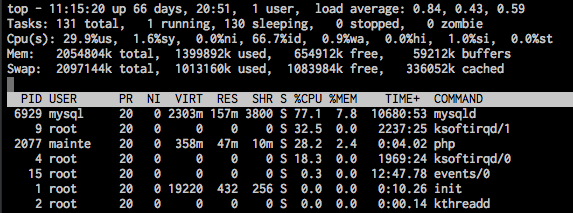

# Linuxコマンド

Linuxコマンドまとめ。  
アルファベット順。

---

## cat
ファイルの中身を標準出力に出力(画面に表示)します。

<br>

####基本形

cat [ファイル名]


<br>

####使用例  

```bash
# /home/work/AAA.txtファイルの中身を出力
$ cat /home/work/AAA.txt
AAA
BBB
CCC
```

```bash
#id_rsa.pubファイルの内容をauthorized_keyファイルの最終行に付け足し
$ cat /tmp/id_rsa.pub >> ~/.ssh/authorized_keys"
```

---

## cd
ディレクトリを移動します。

<br>

####基本形
cd [対象パス]

<br>

####使用例  

```bash
# /var/www/htmlディレクトリに移動
$ cd /var/www/html/
```

---

## cp
ファイルをコピーします。

<br>

####基本形
cp [コピー元パス] [コピー先パス]

<br>

####使用例  

```bash
# 今いるディレクトリのA.htmlファイルを一つ上の階層にコピー
$ cp ./A.html ..
```

---

## chmod
* ファイルやディレクトリの権限を変更します。
* 権限については[ここらへん](http://www.webzoit.net/hp/it/internet/homepage/env/cs/server/os/type/unix/linux/command/permissions/modes/)をご確認ください。
* ファイル権限によっては意図した場面でプログラムが動かなかったり、編集できない人が出たりします。

<br>

####基本形
chmod [パーミッション] [ファイル名]

<br>

####使用例  

```bash
# index.htmlのパーミッションを755に変更します
$ chmod 755 index.html
```

---

## chown
ファイルやディレクトリの所有者を変更します。

<br>

####基本形
chown [所有者] [ファイル名]

<br>

####使用例  

```bash
# /var/www/html配下の所有者を全てuser01に変更する
$ chown -R /var/www/html
```

---

## crontab
* cronとは定期的にコマンドやスクリプト等を自動実行してくれるプログラムです。
* **-l**オプションで、現在設定されているcrontabを表示します。
* **-e**オプションで、crontabを編集します。  
  (crotabの設定の書き方は[こちら](http://www.server-memo.net/tips/crontab.html))  
* **-r**オプションで、現在設定してあるcrontabが全て消えます。
* /var/crontabファイルを直接編集する場合もあります。

<br>

#### 基本形
crontab (オプション)

<br>

#### 使用例  

```bash
$ crontab -l
1 * * * * echo test
```

---

## du
* 特定のディレクトリ等の容量を調べます。
* -shオプションをつけて使うと、見やすいようです。

<br>

#### 基本形
du (オプション)

<br>

#### 使用例  

```bash
#現在のディレクトリ配下の容量を確認
$ du -sh *
4.0K	CONTRIBUTING.md
4.0K	Gruntfile.js
4.0K	LICENSE
240K	css
4.0K	index.html
128K	js
164K	lib
8.0K	md
4.0K	package.json
320K	plugin
184K	test
```
---

## df
* ディスクの使用状況等を確認します。
* -hオプションを使うと分かりやすく表示されるようです。

<br>

#### 基本形
df (オプション)

<br>

#### 使用例

```bash
#色々情報が表示される
$df -h
Filesystem            Size  Used Avail Use% Mounted on
/dev/sda1             7.3G  1.6G  5.4G  23% /
tmpfs                 295M     0  295M   0% /dev/shm
/vagrant              466G  208G  258G  45% /vagrant
/var/www/revealjs     466G  208G  258G  45% /var/www/revealjs
```

---

## diff
2つのファイルの差分を取ります

<br>

#### 基本形
diff (オプション) [ファイル名1] [ファイル名2]

<br>

#### 使用例
```bash
# ./backup/ディレクトリと./src/ディレクトリ内のファイルを比較して、差分をdiff.txtに書き出す
diff -crsb --strip-trailing-cr  ./backup/ ./src/ > ./diff/diff.txt
```

---

## find
* 難しい。

<br>

#### 基本形
find [検索対象パス] -name [ワイルドカード]  
※この使い方しか知らない

<br>

#### 使用例
```bash
# testディレクトリ内にある拡張子が付いたファイルを全て検索する
$ find ./test/ -name '*.*'
./test/.DS_Store
./test/examples/.DS_Store
./test/examples/assets/image1.png
./test/examples/assets/image2.png
./test/examples/barebones.html
./test/examples/embedded-media.html
./test/examples/math.html
./test/examples/slide-backgrounds.html
./test/qunit-1.12.0.css
./test/qunit-1.12.0.js
./test/test-markdown-element-attributes.html
./test/test-markdown-element-attributes.js
./test/test-markdown-slide-attributes.html
./test/test-markdown-slide-attributes.js
./test/test-markdown.html
./test/test-markdown.js
./test/test.html
./test/test.js
```

---

## grep
* 文字列を検索します。
* -i オプションで小文字/大文字の区別なく検索します。
* -r オプションでディレクトリ内を再帰的に検索します。

<br>

#### 基本形
grep (オプション) [検索文字列] [ファイル名/ディレクトリ名]

<br>

#### 使用例

```bash
$ grep -ir 'test' ./
```

---


## php
* phpファイルをコマンドラインから実行する場合に使います。
* ```-f```オプションをつけて使うことが多いです(つけなくても好いようです)。

<br>

#### 基本形
php (オプション) [ファイル名]
<br>

#### 使用例  

```bash
#今いるディレクトリのtext.phpファイルを実行
$ php -f ./test.php
```

---

## top
サーバの稼働状況を確認します。

<br>

####使用例  

```bash
#実行
$ top
```



---

## tail
ファイルの末尾を表示します。  
-fオプションを使うと、対象ファイルの内容を常に監視できます。  
-fをつけて、ログを監視するときによく使います。

<br>

####使用例

<br>

```bash
tail -f ./application.log
```

---

## ssh
サーバにSSHでログインします。

ssh [ユーザ名]@[ホスト]

~.ssh/configでエイリアスを設定することで、簡単に接続できます。  
[.ssh/configファイルで複数サーバーのSSH接続を管理](http://webkaru.net/linux/ssh-config-file/)


**使用例**

```bash
ssh mainte@XXX.XXX.XXX.XXX
```

---

## history
コマンドの実行履歴を表示します。

historyコマンドの後に![番号]を入力すると、その番号のコマンドが
実行されます。

-d [番号]で対象番号のhistory履歴を消去できます。  
間違ってパスワード等を入力してしまった時に使います。


---

## おまけ
reveal.jsとGithub Pagesで資料作成

---

## Github Pagesの用意
1. アカウント作成  
  ・エイリアス(+XXXXX@gmail.com)を使えばメールアドレスを用意しなくてもアカウント簡単に作れる。  
  ・アカウント作成後に、メールでアカウント認証しておかないとGithub Pages使えないようなので注意  

2. リポジトリ作成  
  ・ **[アカウント名].github.io**という名前でリポジトリを作成する。  
  ・カスタムドメインを使う方法もある?

3. Push
  ・適当にindex.htmlを用意し、作成したリポジトリに対してPush
  ・ブラウザで**[アカウント名].github.io**にアクセスするとPushしたindex.htmlが表示される。
  ・最初のPushの場合、ページが見えるようになるまで10分くらいかかるかも。  
  ・HTTPでPushがうまく行かない場合、リモートのアドレスにユーザ名を入れる  
    例： **（url = https://account_namae@github.com/test/test.github.io.git）**
    
---

## reveal.jsの準備
1. [Github](https://github.com/hakimel/reveal.js/)の"Download ZIP"をクリックしてソースを取得
2. 展開したフォルダでgit init。
2. ソースを展開してindex.htmlを開く。
3. 44行目付近の< div class="slides"\> の中のタグを全て消す。
4. 消した箇所に以下をコピペ。


```
            <section data-markdown="./md/revealjs.md"
                     data-separator="\n---\n$"
                     data-vertical="\n--\n">
                <script type="text/template">
                < /script>
            </section>
```

---

## 資料の準備(Markdown)
1. Markdownで記事を書く。(スライドとスライドの区切りには"---"を書く)  
2. index.htmlと同階層にmdディレクトリを用意し、中にrevealjs.mdというファイル名でMarkdownのファイルを入れる
3. git push origin master


---

## 参考
* [Reveal.js、Markdown、Githubでスライドを作成する。](http://qiita.com/budougumi0617/items/19b19019bbe01f86e251)  
* [なんかかっこいいプレゼンテーションテンプレートを探しているならreveal.js使ってみろって](http://qiita.com/ryurock/items/9c6de36b9d6a716e7992)  
* [reveal.js+Markdown](http://qiita.com/siguremon/items/c717eca388070215712c)  
* [REVEAL.JSを使ってみた](http://tmlife-storage.googlecode.com/svn/trunk/reveal.js-guide/index.html#/)  
* [Reveal.jsとMarkdownでちょっとしたスライドを手軽に作る](http://n.blueblack.net/articles/2013-03-02_reveal_js_and_markdown_presentation/)
* [Git初心者でも大丈夫！完全無料でGithub PagesにWebページを公開する方法](http://liginc.co.jp/web/html-css/html/96453)


